# Архитектура: andre-ai-maturity

Telegram-бот диагностики AI-зрелости компании. 35 вопросов по 7 категориям, детерминистический скоринг + LLM-анализ, HTML-отчёт.

---

## 1. Общая архитектура системы

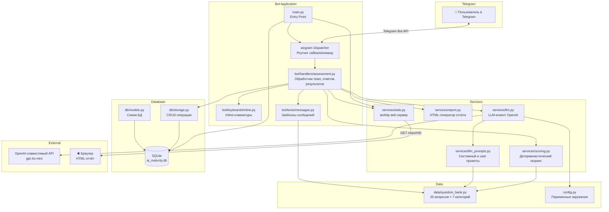

---

## 2. Последовательность работы (User Flow)

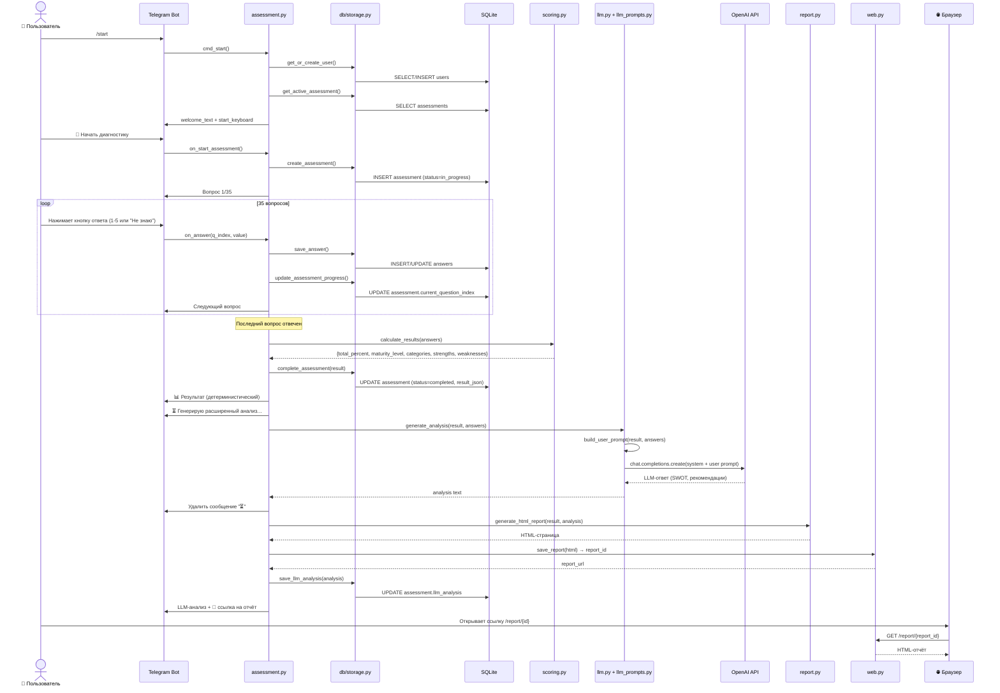

---

## 3. Структура базы данных (SQLite)

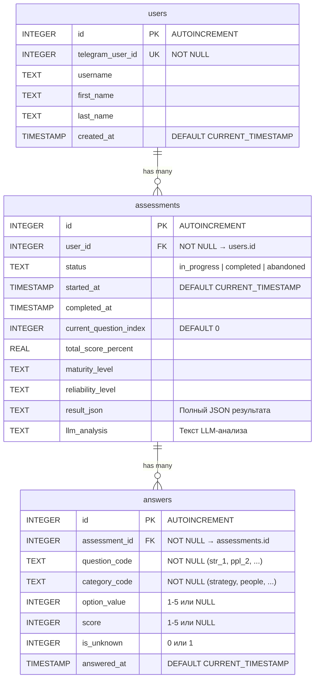

---

## 4. Алгоритм скоринга

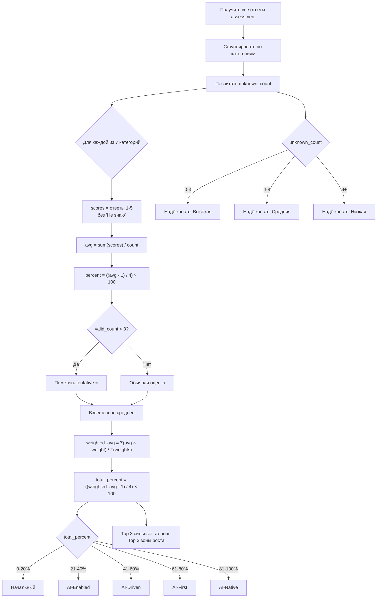

### Веса категорий

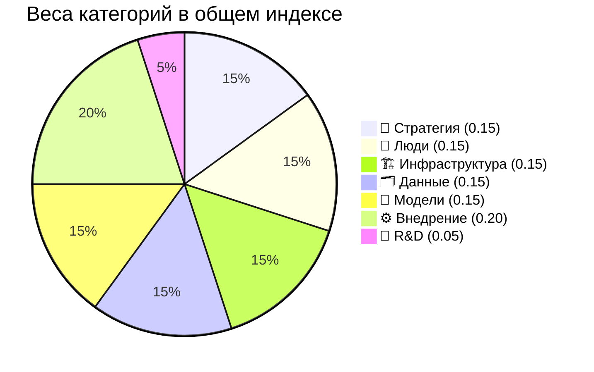

---

## 5. AI / LLM — промпты и последовательность

### 5.1 Архитектура вызова LLM

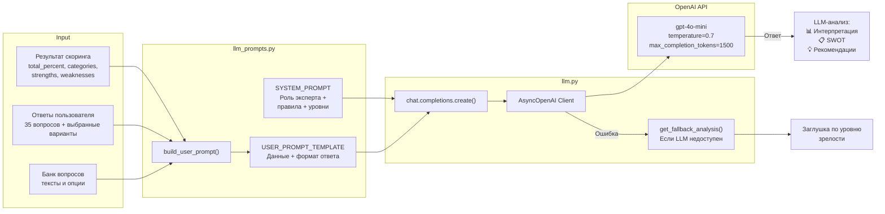

### 5.2 SYSTEM_PROMPT (полный текст)

```
Ты — эксперт по цифровой трансформации и внедрению ИИ в компаниях.
Тебе дают результаты диагностики AI-зрелости компании.
Твоя задача — дать краткий, конкретный и полезный анализ.

Правила:
- Пиши на русском языке.
- Будь максимально кратким — весь ответ СТРОГО до 2000 символов.
- Не повторяй числовые результаты — они уже показаны пользователю.
- Не придумывай факты о компании.
- Не используй маркетинговый язык и воду.
- Давай практичные, применимые советы.
- Формат ответа — текст с эмодзи-заголовками, без markdown-разметки.
- ЗАПРЕЩЕНО добавлять разделы, которых нет в шаблоне.
- Ответ содержит РОВНО 3 раздела: Интерпретация, SWOT, Рекомендации.

Уровни зрелости (ориентир):
1. Начальный (0-20%): ИИ хаотично. Назначить ответственных, зафиксировать метрики, quick wins.
2. AI-Enabled (21-40%): ИИ локально. Стратегия, центр компетенций, ROI.
3. AI-Driven (41-60%): ИИ в процессах. Масштабировать, AgentOps/MLOps/Governance.
4. AI-First (61-80%): ИИ в операционной модели. Автономность, ИИ-платформа, KPI, R&D.
5. AI-Native (81-100%): ИИ — основа бизнеса. Собственные модели, новые рынки, выручка от ИИ.
```

### 5.3 USER_PROMPT_TEMPLATE (шаблон с подстановкой)

```
Результаты диагностики AI-зрелости компании:

Общий индекс: {total_percent}%
Уровень зрелости: {maturity_level}
Надежность результата: {reliability}

Результаты по категориям:
  🎯 Стратегия и управление: 35%
  👥 Люди и культура: 20%
  ...

Сильные стороны: 🎯 Стратегия (35%), ...
Зоны роста: 🔬 R&D (0%), ...

Ответы пользователя:
  Есть ли у компании ИИ-стратегия? → В процессе. ИИ-стратегия в разработке...
  Насколько вовлечено руководство? → Не знаю
  ...

Дай анализ СТРОГО в этом формате, РОВНО 3 раздела, до 2000 символов:

📊 Интерпретация
Сплошной текст, 2-3 предложения.

📋 SWOT-анализ
S: текст
W: текст
O: текст
T: текст

💡 Рекомендации
🚀 Быстрые шаги (сейчас): ...
📅 Среднесрочные (1-3 месяца): ...
🎯 Долгосрочные (3-6 месяцев): ...
```

### 5.4 Fallback (при недоступности LLM)

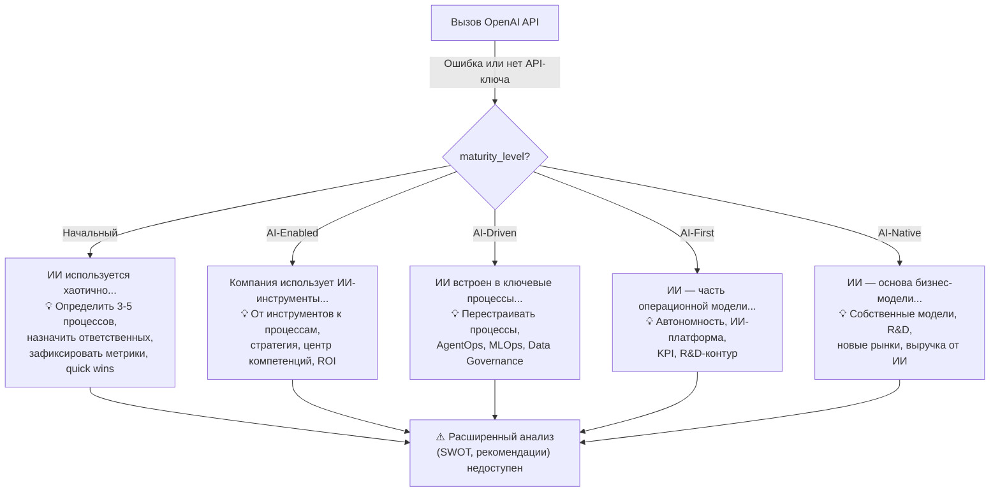

---

## 6. Компоненты и файлы

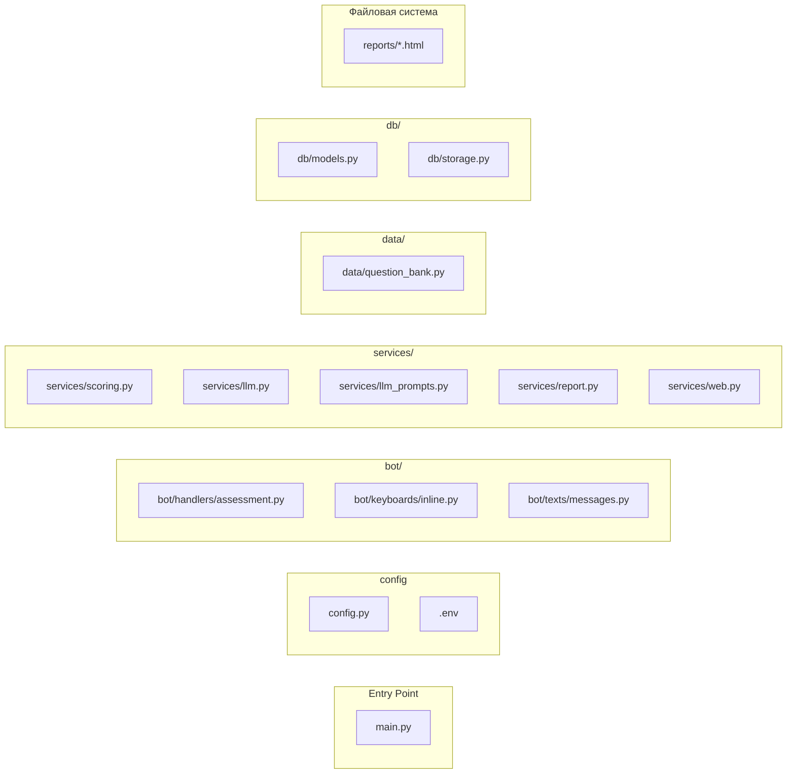

---

## 7. Сервисы и их ответственности

| Сервис | Файл | Ответственность |
|--------|-------|-----------------|
| **Telegram Bot** | `bot/handlers/assessment.py` | Обработка команд `/start`, callback-кнопок, навигация по вопросам, показ результатов |
| **Keyboards** | `bot/keyboards/inline.py` | Генерация inline-клавиатур: старт, вопросы (5 ответов + "Не знаю" + Назад + Прервать), подтверждения |
| **Messages** | `bot/texts/messages.py` | Шаблоны текстов: welcome, question, result, abort/restart |
| **Scoring** | `services/scoring.py` | Детерминистический расчёт: среднее по категориям, взвешенный индекс, уровень зрелости, надёжность, сильные/слабые стороны |
| **LLM Service** | `services/llm.py` | Вызов OpenAI API, fallback-анализ при недоступности |
| **LLM Prompts** | `services/llm_prompts.py` | System prompt (роль + правила), user prompt template, сборка промпта из результатов |
| **Report** | `services/report.py` | Генерация HTML-отчёта (Tailwind CSS, glass-morphism, dark/light тема, анимированные блобы) |
| **Web Server** | `services/web.py` | aiohttp-сервер для раздачи HTML-отчётов по `/report/{id}`, сохранение на диск |
| **Storage** | `db/storage.py` | CRUD: users, assessments, answers |
| **Models** | `db/models.py` | DDL-схема SQLite (3 таблицы) |
| **Question Bank** | `data/question_bank.py` | 35 вопросов, 7 категорий с весами, тексты опций и кнопок |
| **Config** | `config.py` | BOT_TOKEN, LLM_API_KEY, LLM_MODEL, LLM_BASE_URL, DATABASE_PATH, REPORT_BASE_URL, REPORT_PORT |

---

## 8. Технологический стек

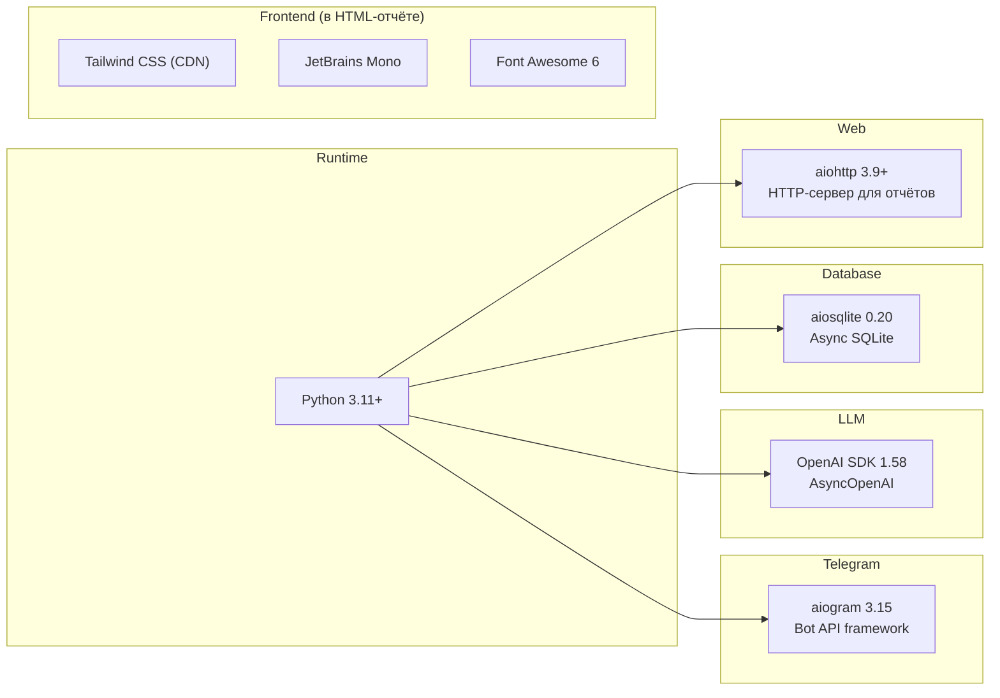

---

## 9. Параметры LLM-вызова

| Параметр | Значение |
|----------|----------|
| **Модель** | `gpt-4o-mini` (настраивается через `LLM_MODEL`) |
| **Base URL** | `https://api.openai.com/v1` (настраивается через `LLM_BASE_URL`) |
| **Temperature** | `0.7` |
| **Max completion tokens** | `1500` |
| **Формат ответа** | Текст с эмодзи-заголовками, без markdown |
| **Лимит** | Строго до 2000 символов |
| **Язык** | Русский |
| **Структура ответа** | 3 раздела: Интерпретация → SWOT → Рекомендации (быстрые/среднесрочные/долгосрочные) |

---

## 10. Тестовые сценарии

Всего **6 тестовых файлов**, **44 теста**. Фреймворк: **pytest** + **pytest-asyncio**.

### 10.1 Карта покрытия тестами

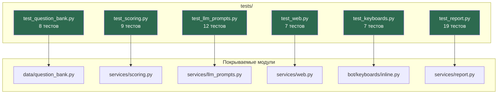

### 10.2 test_question_bank.py — Банк вопросов (8 тестов)

Валидация структурной целостности банка вопросов.

| # | Тест | Что проверяет |
|---|------|---------------|
| 1 | `test_total_questions` | Ровно 35 вопросов в банке |
| 2 | `test_categories_count` | Ровно 7 категорий |
| 3 | `test_five_questions_per_category` | В каждой категории ровно 5 вопросов |
| 4 | `test_weights_sum_to_one` | Сумма весов категорий = 1.0 (±0.001) |
| 5 | `test_each_question_has_required_fields` | Каждый вопрос содержит поля: `code`, `category`, `text`, `hint`, `options` (5 шт), `buttons` (5 шт) |
| 6 | `test_unique_codes` | Все коды вопросов уникальны (нет дубликатов) |
| 7 | `test_all_categories_valid` | Каждый вопрос ссылается на существующую категорию |
| 8 | `test_get_category_by_code` | Хелпер `get_category_by_code()` находит категорию по коду и возвращает `None` для несуществующей |

### 10.3 test_scoring.py — Скоринг (9 тестов)

Проверка детерминистического алгоритма расчёта результатов.

| # | Тест | Что проверяет |
|---|------|---------------|
| 1 | `test_maturity_levels` | Маппинг процентов → уровень зрелости: 0→Начальный, 21→AI-Enabled, 50→AI-Driven, 70→AI-First, 90→AI-Native |
| 2 | `test_reliability` | Маппинг кол-ва "Не знаю" → надёжность: 0-3→Высокая, 4-8→Средняя, 9+→Низкая |
| 3 | `test_all_fives` | Все ответы = 5 → индекс 100%, уровень AI-Native, надёжность Высокая, 7 категорий |
| 4 | `test_all_ones` | Все ответы = 1 → индекс 0%, уровень Начальный |
| 5 | `test_all_threes` | Все ответы = 3 → индекс 50%, уровень AI-Driven |
| 6 | `test_unknown_answers_reduce_reliability` | 10 ответов "Не знаю" → надёжность Низкая, `unknown_count = 10` |
| 7 | `test_strengths_and_weaknesses` | Результат содержит ровно 3 сильные стороны и 3 зоны роста |
| 8 | `test_mixed_scores` | Смешанные оценки: strategy=5 (100%), people=1 (0%), остальные=3 → общий индекс между 0 и 100 |
| 9 | `test_tentative_category` | Категория с <3 валидными ответами помечается как `tentative = True` |
| 10 | `test_empty_answers` | Пустой список ответов → 0%, уровень Начальный |

### 10.4 test_llm_prompts.py — LLM-промпты (12 тестов)

Проверка содержания и структуры промптов для LLM, без реального вызова API.

| # | Тест | Что проверяет |
|---|------|---------------|
| 1 | `test_system_prompt_exists` | System prompt существует и длиннее 50 символов, содержит слово "русском" |
| 2 | `test_system_prompt_contains_maturity_levels` | System prompt содержит все 5 уровней зрелости |
| 3 | `test_system_prompt_enforces_brevity` | System prompt содержит лимит "2000" символов |
| 4 | `test_system_prompt_forbids_extra_sections` | System prompt содержит "ЗАПРЕЩЕНО", "AS-IS", "РОВНО 3 раздела" |
| 5 | `test_user_prompt_has_exactly_three_sections` | User prompt содержит 3 раздела: Интерпретация, SWOT, Рекомендации + фразу "РОВНО 3 раздела" |
| 6 | `test_prompt_interpretation_no_bullets` | User prompt требует "Сплошной текст" и "Без буллетов" |
| 7 | `test_prompt_swot_no_bullets` | SWOT использует формат `S: текст без буллетов`, `W: текст без буллетов` |
| 8 | `test_prompt_has_roadmap_recommendations` | User prompt содержит три горизонта: Быстрые шаги, Среднесрочные, Долгосрочные |
| 9 | `test_prompt_quick_steps_start_with_strategy` | Быстрые шаги упоминают "стратегии" |
| 10 | `test_no_asis_in_user_prompt` | User prompt НЕ содержит "AS-IS", "Процессные шаги", "Узкие места", "Потенциал автоматизации" |
| 11 | `test_build_user_prompt` | `build_user_prompt()` с ответами=3 генерирует промпт с "50.0%", "AI-Driven", длина >200 |
| 12 | `test_build_user_prompt_low_score` | `build_user_prompt()` с ответами=1 генерирует промпт с "0.0%", "Начальный" |
| 13 | `test_prompt_with_unknown_answers` | Промпт с 5 ответами "Не знаю" содержит текст "Не знаю" |

### 10.5 test_web.py — Веб-сервер (7 тестов)

Проверка сохранения и раздачи HTML-отчётов. Использует `cleanup_reports` fixture для очистки каталога.

| # | Тест | Что проверяет | Тип |
|---|------|---------------|-----|
| 1 | `test_save_report_creates_file` | `save_report()` создаёт файл с 12-символьным ID | sync |
| 2 | `test_save_report_content` | Содержимое сохранённого файла совпадает с переданным HTML | sync |
| 3 | `test_get_report_url` | `get_report_url()` возвращает URL вида `/report/{id}` | sync |
| 4 | `test_unique_ids` | Два вызова `save_report()` дают разные ID | sync |
| 5 | `test_web_app_serves_report` | GET `/report/{id}` возвращает 200 и содержимое файла | **async** |
| 6 | `test_web_app_404_missing` | GET на несуществующий отчёт → 404 | **async** |
| 7 | `test_web_app_404_invalid_id` | GET с path traversal (`../../etc/passwd`) → 404 (защита от LFI) | **async** |

### 10.6 test_keyboards.py — Клавиатуры (7 тестов)

Проверка формирования Telegram inline-клавиатур.

| # | Тест | Что проверяет |
|---|------|---------------|
| 1 | `test_question_keyboard_buttons_one_per_row` | 5 кнопок ответов расположены вертикально (по 1 на строку) |
| 2 | `test_question_keyboard_has_dont_know` | 6-я строка — кнопка "🤷 Не знаю" с callback `ans:0:0` |
| 3 | `test_question_keyboard_has_navigation` | Первый вопрос: нет кнопки "Назад", есть "Прервать". Второй вопрос: есть обе |
| 4 | `test_question_keyboard_answer_values` | Кнопки ответов имеют правильные callback_data: `ans:0:1` … `ans:0:5` |
| 5 | `test_start_keyboard_no_progress` | Стартовая клавиатура без прогресса: 1 кнопка "Начать диагностику" |
| 6 | `test_start_keyboard_with_progress` | Стартовая клавиатура с прогрессом: 2 кнопки ("Продолжить" + "Начать заново") |
| 7 | `test_finish_keyboard` | Финальная клавиатура: 1 кнопка "Пройти заново" с callback `restart_confirm` |

### 10.7 test_report.py — HTML-отчёт (19 тестов)

Самый большой тестовый файл. Проверяет генерацию HTML-отчёта и конвертацию текста в HTML.

| # | Тест | Что проверяет |
|---|------|---------------|
| 1 | `test_report_returns_valid_html` | Отчёт начинается с `<!DOCTYPE html>` и содержит `</html>` |
| 2 | `test_report_has_dark_mode` | Есть `class="dark"` и кнопка `theme-toggle` |
| 3 | `test_report_has_tailwind` | Подключён Tailwind CSS CDN |
| 4 | `test_report_has_jetbrains_mono` | Подключён шрифт JetBrains Mono |
| 5 | `test_report_has_brand_colors` | Используются брендовые цвета `#8854F3` (purple) и `#F97316` (orange) |
| 6 | `test_report_contains_results` | Отчёт содержит "50.0%" и "AI-Driven" |
| 7 | `test_report_contains_categories` | Отчёт содержит названия категорий: Стратегия, Данные, Внедрение |
| 8 | `test_report_has_progress_bars` | Присутствуют CSS-классы градиентных прогресс-баров |
| 9 | `test_report_contains_analysis` | При наличии LLM-анализа текст включён в отчёт |
| 10 | `test_report_without_analysis` | Без анализа отчёт всё равно генерируется корректно |
| 11 | `test_report_has_no_pdf_button` | Нет кнопки "Сохранить как PDF" |
| 12 | `test_report_has_print_css` | Есть `@media print` для печати |
| 13 | `test_report_has_og_meta_tags` | Есть OG мета-теги: `og:title`, `og:description`, `og:image` |
| 14 | `test_report_has_andre_ai_branding` | Брендинг "Andre AI" + "Technologies" присутствует |
| 15 | `test_report_has_animated_blobs` | Анимированные блобы: `blob-purple`, `blob-orange`, `animateBlobs` |
| 16 | `test_text_to_html_headers` | Эмодзи-заголовки (📊) → `<h3>`, обычный текст → `<p>` |
| 17 | `test_text_to_html_list_items` | Строки с `-` или `•` → `<li>` |
| 18 | `test_text_to_html_process_chain` | Строки вида `[Этап 1] → [Этап 2]` → блок `process-chain` |
| 19 | `test_report_escapes_html` | **XSS-защита**: `<script>alert('xss')</script>` экранируется в `&lt;script&gt;` |
| 20 | `test_text_to_html_sub_header_only_label_bold` | Подзаголовки (🚀/📅/🎯) — жирный только до двоеточия, текст после — обычный |
| 21 | `test_text_to_html_section_header_fully_bold` | Главные заголовки (📊/📋/💡) — полностью жирные |
| 22 | `test_report_strengths_and_weaknesses` | Отчёт содержит блоки "Сильные стороны" и "Зоны роста" |

### 10.8 Что НЕ покрыто тестами

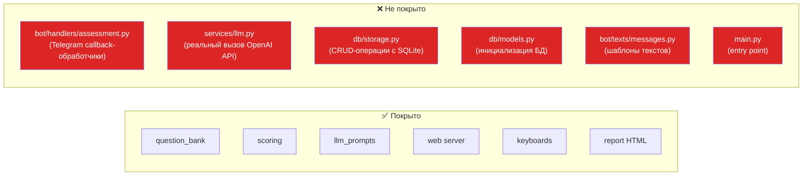

**Ключевые наблюдения:**
- Тесты полностью детерминистические (кроме 3 async-тестов для aiohttp)
- LLM не вызывается в тестах — проверяется только содержание промптов
- Нет интеграционных тестов (Telegram Bot + SQLite + LLM)
- Нет тестов для `db/storage.py` (CRUD)
- Нет тестов для `bot/handlers/assessment.py` (основная бизнес-логика бота)
