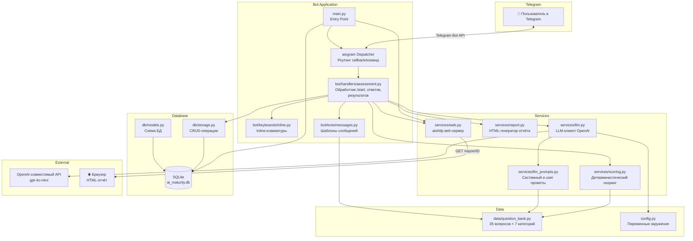
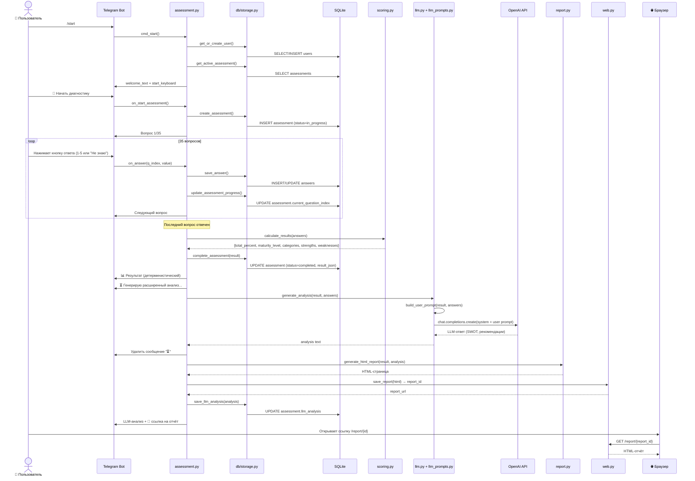
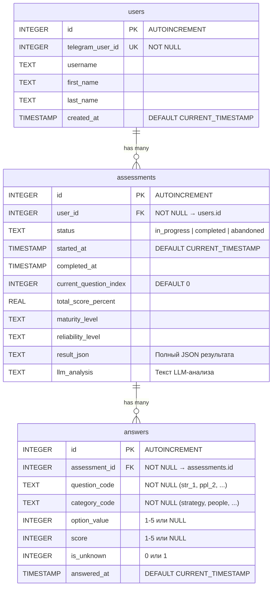
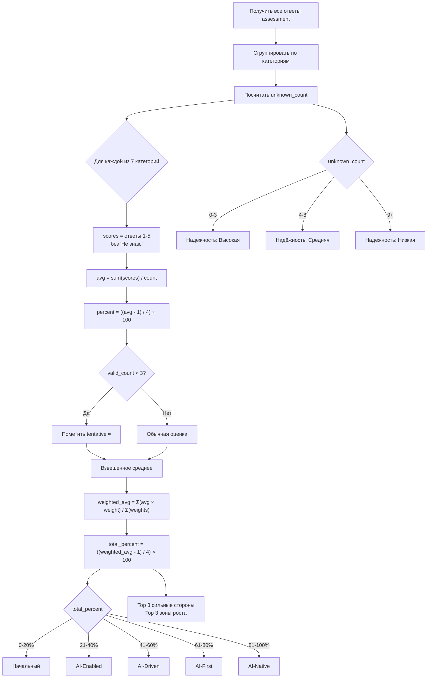
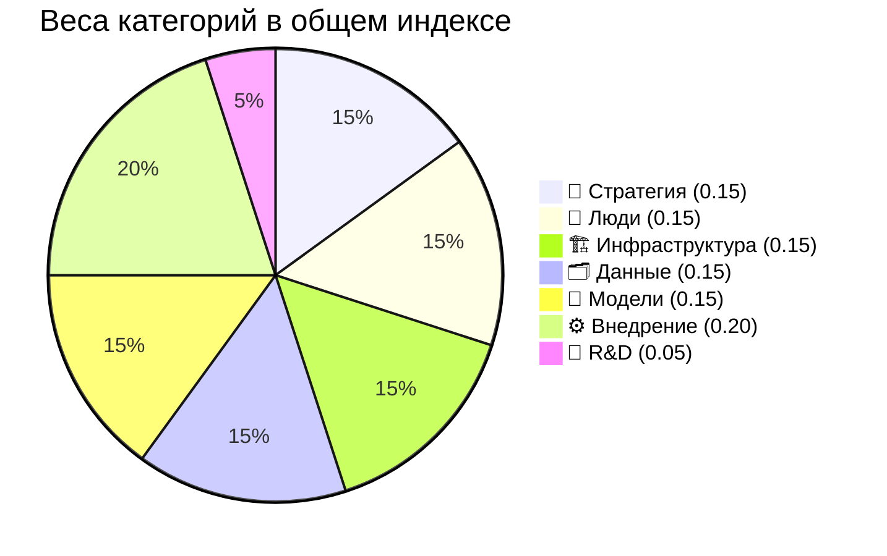
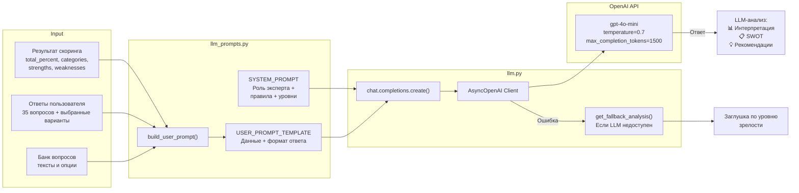
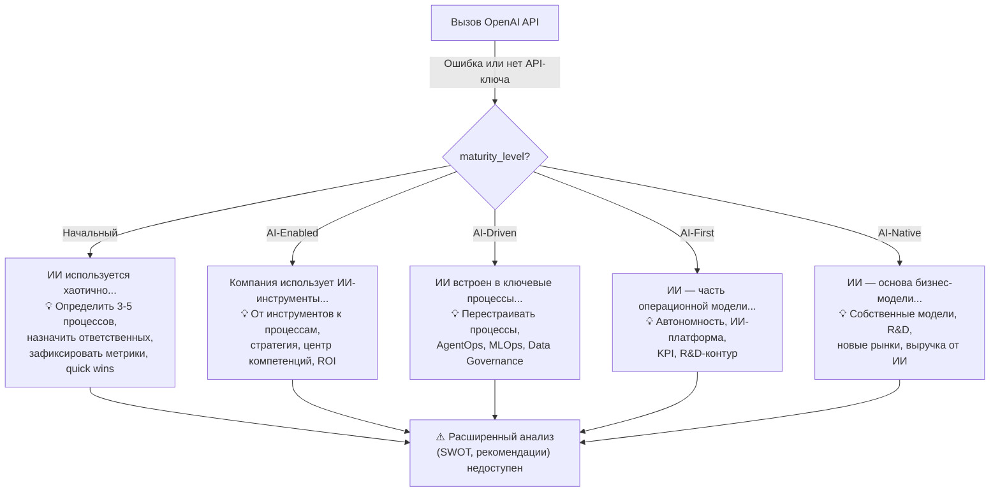
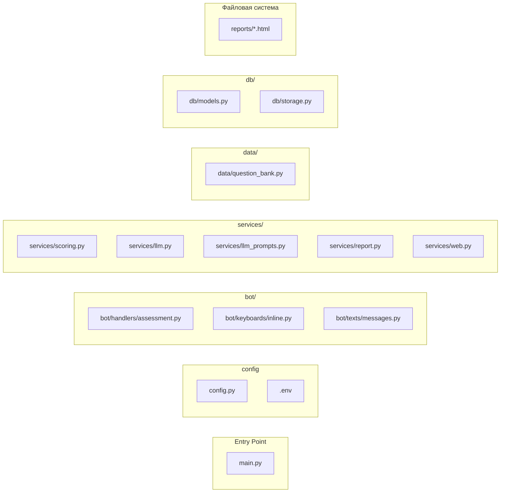
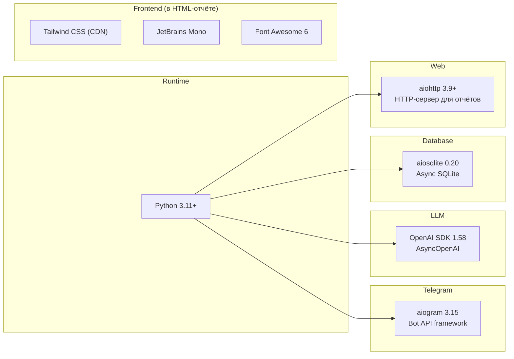

# Архитектура: andre-ai-maturity

Telegram-бот диагностики AI-зрелости компании. 35 вопросов по 7 категориям, детерминистический скоринг + LLM-анализ, HTML-отчёт.

---

## 1. Общая архитектура системы



---

## 2. Последовательность работы (User Flow)



---

## 3. Структура базы данных (SQLite)



---

## 4. Алгоритм скоринга



### Веса категорий



---

## 5. AI / LLM — промпты и последовательность

### 5.1 Архитектура вызова LLM



### 5.2 SYSTEM_PROMPT (полный текст)

```
Ты — эксперт по цифровой трансформации и внедрению ИИ в компаниях.
Тебе дают результаты диагностики AI-зрелости компании.
Твоя задача — дать краткий, конкретный и полезный анализ.

Правила:
- Пиши на русском языке.
- Будь максимально кратким — весь ответ СТРОГО до 2000 символов.
- Не повторяй числовые результаты — они уже показаны пользователю.
- Не придумывай факты о компании.
- Не используй маркетинговый язык и воду.
- Давай практичные, применимые советы.
- Формат ответа — текст с эмодзи-заголовками, без markdown-разметки.
- ЗАПРЕЩЕНО добавлять разделы, которых нет в шаблоне.
- Ответ содержит РОВНО 3 раздела: Интерпретация, SWOT, Рекомендации.

Уровни зрелости (ориентир):
1. Начальный (0-20%): ИИ хаотично. Назначить ответственных, зафиксировать метрики, quick wins.
2. AI-Enabled (21-40%): ИИ локально. Стратегия, центр компетенций, ROI.
3. AI-Driven (41-60%): ИИ в процессах. Масштабировать, AgentOps/MLOps/Governance.
4. AI-First (61-80%): ИИ в операционной модели. Автономность, ИИ-платформа, KPI, R&D.
5. AI-Native (81-100%): ИИ — основа бизнеса. Собственные модели, новые рынки, выручка от ИИ.
```

### 5.3 USER_PROMPT_TEMPLATE (шаблон с подстановкой)

```
Результаты диагностики AI-зрелости компании:

Общий индекс: {total_percent}%
Уровень зрелости: {maturity_level}
Надежность результата: {reliability}

Результаты по категориям:
  🎯 Стратегия и управление: 35%
  👥 Люди и культура: 20%
  ...

Сильные стороны: 🎯 Стратегия (35%), ...
Зоны роста: 🔬 R&D (0%), ...

Ответы пользователя:
  Есть ли у компании ИИ-стратегия? → В процессе. ИИ-стратегия в разработке...
  Насколько вовлечено руководство? → Не знаю
  ...

Дай анализ СТРОГО в этом формате, РОВНО 3 раздела, до 2000 символов:

📊 Интерпретация
Сплошной текст, 2-3 предложения.

📋 SWOT-анализ
S: текст
W: текст
O: текст
T: текст

💡 Рекомендации
🚀 Быстрые шаги (сейчас): ...
📅 Среднесрочные (1-3 месяца): ...
🎯 Долгосрочные (3-6 месяцев): ...
```

### 5.4 Fallback (при недоступности LLM)



---

## 6. Компоненты и файлы



---

## 7. Сервисы и их ответственности

| Сервис | Файл | Ответственность |
|--------|-------|-----------------|
| **Telegram Bot** | `bot/handlers/assessment.py` | Обработка команд `/start`, callback-кнопок, навигация по вопросам, показ результатов |
| **Keyboards** | `bot/keyboards/inline.py` | Генерация inline-клавиатур: старт, вопросы (5 ответов + "Не знаю" + Назад + Прервать), подтверждения |
| **Messages** | `bot/texts/messages.py` | Шаблоны текстов: welcome, question, result, abort/restart |
| **Scoring** | `services/scoring.py` | Детерминистический расчёт: среднее по категориям, взвешенный индекс, уровень зрелости, надёжность, сильные/слабые стороны |
| **LLM Service** | `services/llm.py` | Вызов OpenAI API, fallback-анализ при недоступности |
| **LLM Prompts** | `services/llm_prompts.py` | System prompt (роль + правила), user prompt template, сборка промпта из результатов |
| **Report** | `services/report.py` | Генерация HTML-отчёта (Tailwind CSS, glass-morphism, dark/light тема, анимированные блобы) |
| **Web Server** | `services/web.py` | aiohttp-сервер для раздачи HTML-отчётов по `/report/{id}`, сохранение на диск |
| **Storage** | `db/storage.py` | CRUD: users, assessments, answers |
| **Models** | `db/models.py` | DDL-схема SQLite (3 таблицы) |
| **Question Bank** | `data/question_bank.py` | 35 вопросов, 7 категорий с весами, тексты опций и кнопок |
| **Config** | `config.py` | BOT_TOKEN, LLM_API_KEY, LLM_MODEL, LLM_BASE_URL, DATABASE_PATH, REPORT_BASE_URL, REPORT_PORT |

---

## 8. Технологический стек



---

## 9. Параметры LLM-вызова

| Параметр | Значение |
|----------|----------|
| **Модель** | `gpt-4o-mini` (настраивается через `LLM_MODEL`) |
| **Base URL** | `https://api.openai.com/v1` (настраивается через `LLM_BASE_URL`) |
| **Temperature** | `0.7` |
| **Max completion tokens** | `1500` |
| **Формат ответа** | Текст с эмодзи-заголовками, без markdown |
| **Лимит** | Строго до 2000 символов |
| **Язык** | Русский |
| **Структура ответа** | 3 раздела: Интерпретация → SWOT → Рекомендации (быстрые/среднесрочные/долгосрочные) |
