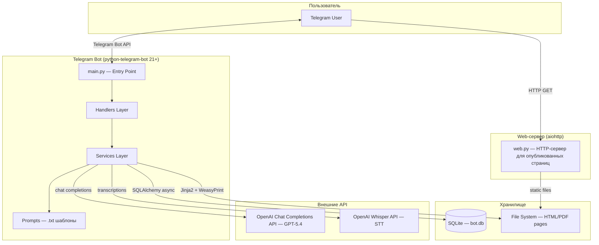
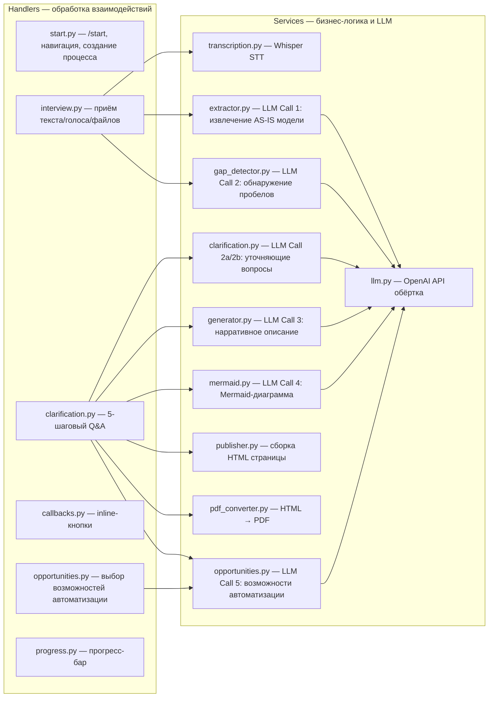
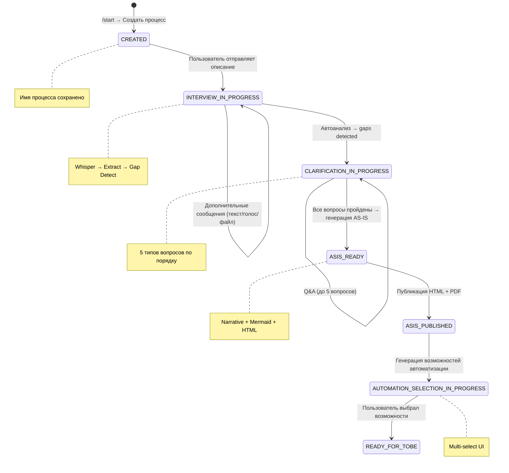
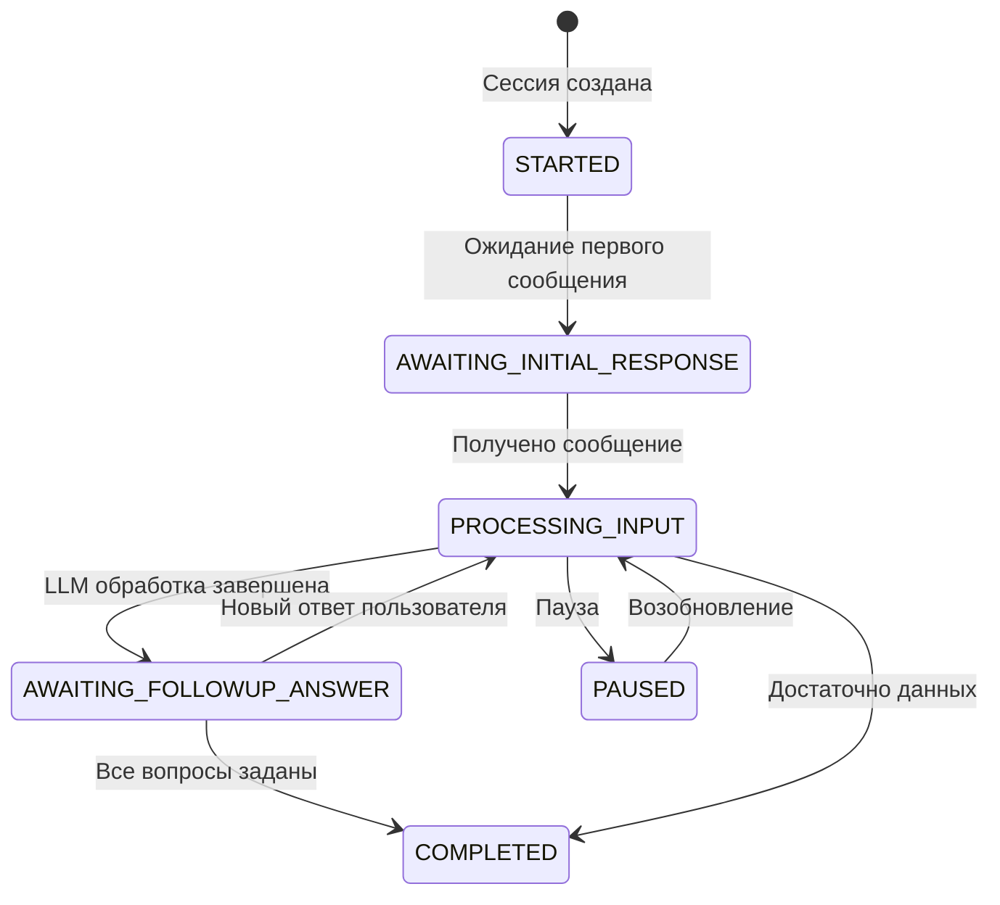
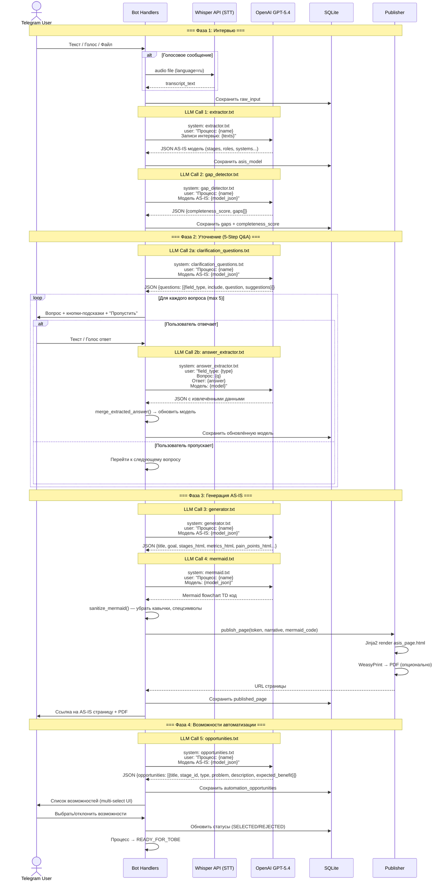
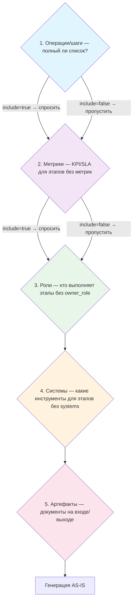
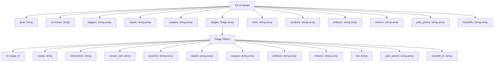
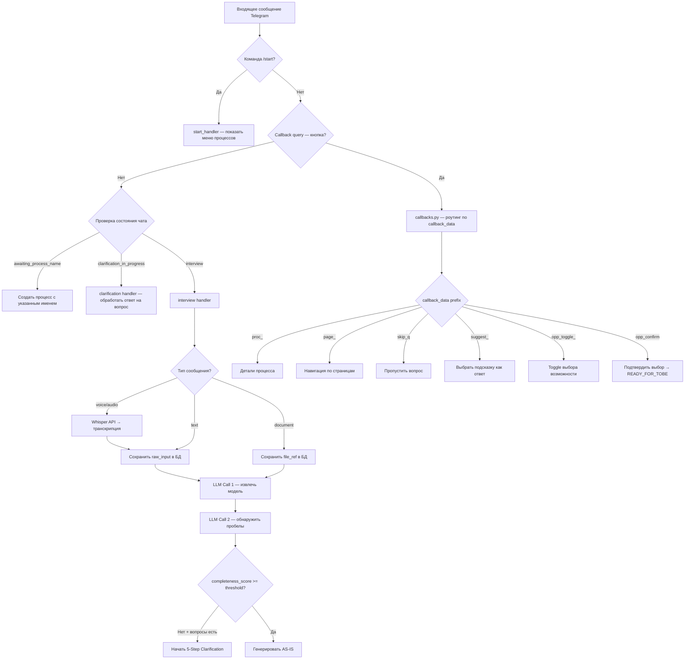
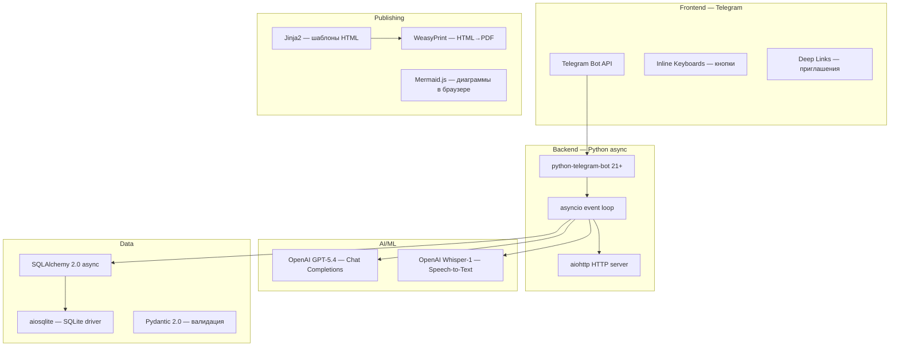

# AIT-OS — Архитектура системы

Telegram-бот для автоматизированного сбора, анализа и публикации описаний бизнес-процессов AS-IS с помощью LLM (GPT-5.4).

---

## 1. Общая архитектура системы



---

## 2. Структура сервисов и их ответственность



---

## 3. Полный жизненный цикл процесса (State Machine)



### Состояния сессии интервью (SessionStatus)



---

## 4. Пайплайн LLM-вызовов и промтов



---

## 5. Детали промтов (Prompts)

### Таблица LLM-вызовов

| # | Файл промта | Сервис | Вход | Выход | Цель |
|---|-------------|--------|------|-------|------|
| 1 | `extractor.txt` | `extractor.py` | Имя процесса + тексты интервью + существующая модель (опц.) | JSON: goal, summary, triggers, stages[], roles, systems, artifacts, metrics, pain_points, handoffs | Извлечь структурированную AS-IS модель из свободного текста |
| 2 | `gap_detector.txt` | `gap_detector.py` | Имя процесса + модель AS-IS (JSON) | JSON: completeness_score (0-1), gaps[] с вопросами | Оценить полноту модели, найти пробелы |
| 2a | `clarification_questions.txt` | `clarification.py` | Имя процесса + модель AS-IS (JSON) | JSON: questions[] (5 категорий, include flag, suggestions) | Сгенерировать до 5 уточняющих вопросов в фиксированном порядке |
| 2b | `answer_extractor.txt` | `clarification.py` | field_type + вопрос + ответ пользователя + модель | JSON: извлечённые значения по типу поля | Извлечь структурированные данные из свободного ответа |
| 3 | `generator.txt` | `generator.py` | Имя процесса + модель AS-IS (JSON) | JSON: HTML-фрагменты (title, goal, stages_html, metrics_html, ...) | Сгенерировать нарративное описание процесса |
| 4 | `mermaid.txt` | `mermaid.py` | Имя процесса + модель (JSON) | Mermaid flowchart TD код | Визуализация процесса в виде блок-схемы |
| 5 | `opportunities.txt` | `opportunities.py` | Имя процесса + модель AS-IS (JSON) | JSON: opportunities[] (title, type, problem, description, expected_benefit) | Предложить возможности автоматизации |

### Порядок уточняющих вопросов (Clarification Flow)



---

## 6. База данных — ER-диаграмма

```mermaid
erDiagram
    COMPANIES {
        int id PK
        string name
        datetime created_at
    }

    PROCESSES {
        int id PK
        int company_id FK
        string name
        enum status "CREATED|INTERVIEW_IN_PROGRESS|CLARIFICATION_IN_PROGRESS|ASIS_READY|ASIS_PUBLISHED|AUTOMATION_SELECTION_IN_PROGRESS|READY_FOR_TOBE"
        datetime created_at
        datetime updated_at
    }

    RESPONDENTS {
        int id PK
        int telegram_user_id UK
        string display_name
        string role_label
        int invited_by FK
        datetime created_at
    }

    INTERVIEW_SESSIONS {
        int id PK
        int process_id FK
        int respondent_id FK
        string token UK "32 chars"
        enum state "STARTED|AWAITING_INITIAL_RESPONSE|PROCESSING_INPUT|AWAITING_FOLLOWUP_ANSWER|PAUSED|COMPLETED"
        datetime started_at
        datetime last_activity_at
        datetime completed_at
    }

    RAW_INPUTS {
        int id PK
        int session_id FK
        string message_type "text|voice|audio"
        int telegram_message_id
        text raw_text
        string file_ref
        text transcript_text
        datetime created_at
    }

    ASIS_MODELS {
        int id PK
        int process_id FK_UK
        int version
        text goal
        text summary
        json triggers
        json inputs
        json outputs
        json stages "id, name, description, owner_role, systems, inputs, outputs, artifacts, metrics, sla, pain_points, handoff_to"
        json roles
        json systems
        json artifacts
        json metrics
        json pain_points
        json handoffs
        float completeness_score "0.0-1.0"
        datetime generated_at
    }

    GAPS {
        int id PK
        int process_id FK
        string stage_id
        enum field_type "ROLES|SYSTEMS|ARTIFACTS|METRICS|TRIGGER|OUTPUT|SLA_TIMING|HANDOFF|DECISION_POINT|GOAL|INPUT|PAIN_POINTS"
        text question_text
        float confidence_score
        enum status "PENDING|ANSWERED|SKIPPED"
        int answer_ref FK
        datetime created_at
    }

    AUTOMATION_OPPORTUNITIES {
        int id PK
        int process_id FK
        string stage_id
        string title
        enum opp_type "AI|RULE_BASED|INTEGRATION|ANALYTICS|MONITORING"
        text problem
        text description
        text expected_benefit
        enum status "PROPOSED|SELECTED|REJECTED|SKIPPED"
        datetime created_at
    }

    PUBLISHED_PAGES {
        int id PK
        int process_id FK
        string token UK "32 chars"
        int asis_version
        text mermaid_code
        text narrative_html
        string html_url
        string pdf_path
        datetime created_at
    }

    COMPANIES ||--o{ PROCESSES : "has"
    PROCESSES ||--o{ INTERVIEW_SESSIONS : "has"
    PROCESSES ||--o| ASIS_MODELS : "has one"
    PROCESSES ||--o{ GAPS : "has"
    PROCESSES ||--o{ AUTOMATION_OPPORTUNITIES : "has"
    PROCESSES ||--o{ PUBLISHED_PAGES : "has"
    RESPONDENTS ||--o{ INTERVIEW_SESSIONS : "participates"
    RESPONDENTS ||--o{ RESPONDENTS : "invited_by"
    INTERVIEW_SESSIONS ||--o{ RAW_INPUTS : "has"
    RAW_INPUTS ||--o{ GAPS : "answer_ref"
```

---

## 7. Структура JSON модели AS-IS (asis_models.stages)



---

## 8. Обработка входящих сообщений (Message Routing)



---

## 9. Стек технологий



---

## 10. UX-принципы

| Принцип | Описание |
|---------|----------|
| **One-message editing** | Бот редактирует одно сообщение вместо отправки новых — чистый чат |
| **Auto-delete user messages** | Сообщения пользователя удаляются после обработки |
| **Progress bar** | Анимированный прогресс при LLM-вызовах (▓░░░░ → ▓▓▓▓▓) |
| **Typewriter effect** | Постепенный вывод транскрипции голоса |
| **Pagination** | 5 процессов на страницу с кнопками навигации |
| **Suggestions** | Кнопки-подсказки для ответов на уточняющие вопросы |
| **Multi-select** | Чекбоксы для выбора возможностей автоматизации |
